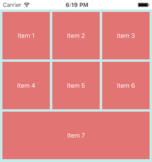

# ASJCollectionViewFillLayout

The standard available `UICollectionViewLayout` does the job well, but the UI may look asymmetric, depending on the number of items the `UICollectionView` is displaying. This library attempts to solve this problem. This is a `UICollectionViewLayout` subclass that fills the full width of the collection view.

# Installation

CocoaPods is the preferred way to install this library. Add this command to your `Podfile`:

```
pod 'ASJCollectionViewFillLayout'
```

If you prefer the classic way, just copy the `ASJCollectionViewFillLayout` folder (.h and .m files) to your project.

# Usage

Creating an `ASJCollectionViewFillLayout` is easy. It has a simple interface consisting of three properties. You can also use the traditional delegate pattern to return the attributes you wish to use. All are optional.

```objc
@property (assign, nonatomic) NSInteger numberOfItemsInRow;
```
Sets the number of items to show in one row.

```objc
@property (assign, nonatomic) CGFloat itemHeight;
```
Sets the height of an item. The width will be calculated to fill the view.

```objc
@property (assign, nonatomic) CGFloat itemSpacing;
```
Sets the distance between two collection view items.

For example:

```objc
ASJCollectionViewFillLayout *aFillLayout = [[ASJCollectionViewFillLayout alloc] init];
aFillLayout.numberOfItemsInRow = 3;
aFillLayout.itemSpacing = 5.0f;
aFillLayout.itemHeight = 75.0f;
aCollectionView.collectionViewLayout = aFillLayout;
```

See the example project for a demonstration of how to use the delegate pattern.




# Credits

- Damir Tursunovic - [Implementing UICollectionViewLayout](http://damir.me/implementing-uicollectionview-layout).

# To-do

- ~~Handle case of total collection view items being less than the number of items in one row~~

# License

`ASJCollectionViewFillLayout` is available under the MIT license. See the LICENSE file for more info.
